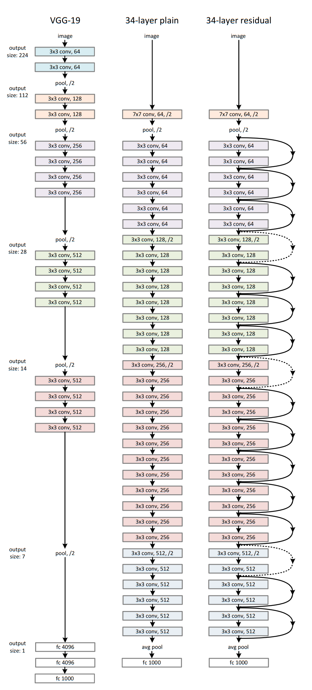
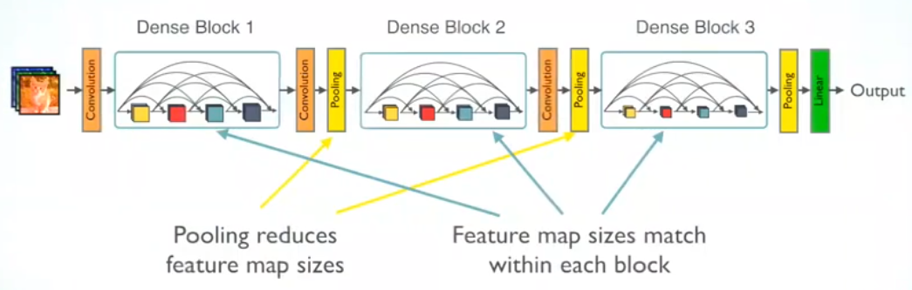

**卷积神经网络家族整理（更新中）**

2020年10月15日星期四

>   目录

[1 前言	2](#_Toc53672123)

>   [1.1 卷积神经网络总览	2](#_Toc53672124)

>   [1.2 参考文档	3](#_Toc53672125)

[2 LeNet-5	3](#_Toc53672126)

>   [2.1 时间和起因	4](#_Toc53672127)

>   [2.2 网络结构	4](#_Toc53672128)

[3 AlexNet	4](#_Toc53672129)

>   [3.1 时间和背景	4](#_Toc53672130)

>   [3.2 网络结构	4](#_Toc53672131)

[4 VGG	6](#_Toc53672132)

>   [4.1 时间和背景	6](#_Toc53672133)

>   [4.2 网络结构	6](#_Toc53672134)

>   [4.3 参考博客	7](#_Toc53672135)

[5 Network in Network	7](#_Toc53672136)

>   [5.1 时间和简介	8](#_Toc53672137)

>   [5.2 论文摘要	8](#_Toc53672138)

>   [5.3 网络结构	8](#_Toc53672139)

>   [5.4 网络特点	9](#_Toc53672140)

>   [5.5 参考文献	9](#_Toc53672141)

[6 Inception网络	9](#_Toc53672142)

>   [6.1 简介	9](#_Toc53672143)

>   [6.2 Inception的特点	10](#_Toc53672144)

>   [6.3 GoogLeNet	11](#_Toc53672145)

>   [6.3.1 时间和简介	11](#_Toc53672146)

>   [6.3.2	网络结构	11](#_Toc53672147)

>   [6.3.3	Layer设计	12](#_Toc53672148)

>   [6.4 Inception v2	13](#_Toc53672149)

>   [6.5 Inception v3	16](#_Toc53672150)

>   [6.6 Inception v4	16](#_Toc53672151)

>   [6.6.1	时间和背景	16](#_Toc53672152)

>   [6.6.2	网络结构	17](#_Toc53672153)

>   [6.7 Inception-resnet v1	20](#_Toc53672154)

>   [6.8 参考文献	21](#_Toc53672155)

[7 Resnet	22](#_Toc53672156)

>   [7.1 时间和简介	22](#_Toc53672157)

>   [7.2 网络结构	22](#_Toc53672158)

>   [7.2.1	残差块的结构	22](#_Toc53672159)

>   [7.2.2	结构示意图	23](#_Toc53672160)

>   [7.2.3	多种深度的网络	25](#_Toc53672161)

>   [7.3 参考文献	25](#_Toc53672162)

[8 DenseNet	25](#_Toc53672163)

>   [8.1 时间和简介	25](#_Toc53672164)

>   [8.2 论文摘要	26](#_Toc53672165)

>   [8.3 网络结构	26](#_Toc53672166)

>   [8.3.1	示意图	26](#_Toc53672167)

>   [8.3.2	稠密块	26](#_Toc53672168)

>   [8.3.3	DenseNets结构	27](#_Toc53672169)

# 前言

## 卷积神经网络总览

图1.1-1 展示了卷积神经网络的起源和在不同发展思想的分支汇合

图1.1-1 卷积神经网络的发展思路

图1.1-2
展示了不同网络架构的一个综合性能对比，越在左上角网络越好，横轴代表计算量，纵轴代表准确率，圆形大小代表参数量

图1.1-2 卷积神经网络的家族性能对比图

图1.1-3 是部分网络的沿着时间发展史

图1.1-3 网络的时间发展史

## 参考文档

典型卷积神经网络架构：

<https://www.cnblogs.com/whenyd/p/7886637.html#0-figures-first>

从LeNet到SENet——卷积神经网络回顾：

<https://www.toutiao.com/a6765725794024030723/>

# LeNet-5

## 时间和起因

LeNet-5是在1998年LeCun等人 提出，虽然提出的时间比较早，
但它是一个非常成功的神经网络模型． 基于 LeNet-5的手写数字识别系统在 20 世纪 90
年代被美国很多银行使用， 用来识别支票上面的手写数字

## 网络结构

>   LeNet-5共有7层，接受输入图像大小为32 × 32 = 1 024，输出对应 10个类别的得分．

| 每层           | 卷积参数             | 输出                    |
|----------------|----------------------|-------------------------|
| C1卷积层       | 6个5×5的卷积核       | 6组28×28的特征映射      |
| S2层为汇聚层   | 采样窗口为 2 × 2,avg | 6 × 14 × 14             |
| C3层为卷积层   | 60 个 5 × 5 的卷积核 | 16 组10 × 10 的特征映射 |
| S4层是汇聚层   | 采样窗口为2 × 2      | 16个5 × 5的特征映射     |
| C5 层是卷积层  | 120 × 16 个 5 × 5    | 120 组 1 × 1 的特征映射 |
| F6层是全连接层 | 120\*84              | 84                      |

# AlexNet

## 时间和背景

AlexNet[Krizhevsky et al., 2012] 是第一个现代深度卷积网络模型，
其首次使用了很多现代深度卷积网络的技术方法， 比如使用 GPU 进行并行训练， 采用了
ReLU 作为非线性激活函数， 使用 Dropout 防止过拟合，
使用数据增强来提高模型准确率等． AlexNet赢得了2012年ImageNet图像分类竞赛的冠军．

## 网络结构

AlexNet的结构如图所示， 包括5个卷积层、
3个汇聚层和3个全连接层（其中最后一层是使用 Softmax 函数的输出层）．
因为网络规模超出了当时的单个GPU的内存限制，AlexNet将网络拆为两半，
分别放在两个GPU上， GPU间只在某些层（ 比如第3层） 进行通信．

AlexNet的输入为224 × 224 × 3的图像， 输出为1 000个类别的条件概率， 具

体结构如下：

| 层次                                               |                                                                   |                                              |
|----------------------------------------------------|-------------------------------------------------------------------|----------------------------------------------|
| 第一个卷积层                                       | 11×11×3×48的卷积核 步长𝑆 = 4， 零填充𝑃 = 3                        | 得到两个大小为55 × 55 × 48的特征映射组       |
| 第一个汇聚层                                       | 3 × 3的最大汇聚 步长𝑆 = 2                                         | 得到两个27 × 27 × 48的特征映射组             |
| 第二个卷积层                                       | 5×5×48×128的卷积核 步长𝑆 = 1 零填充𝑃 = 2                          | 两个大小为27 × 27 × 128的特征映射组          |
| 第二个汇聚层                                       | 3 × 3的最大汇聚操作 步长𝑆 = 2                                     | 得到两 个大小为13 × 13 × 128的特征映射组     |
| 第三个卷积层为两个路径的融合                       | 两个3 × 3 × 256 × 384 的卷积核 步长 𝑆 = 1， 零填充 𝑃 = 1          | 得到两个大小为 13 × 13 × 192 的特征映 射组． |
| 第四个卷积层                                       | 两个大小为 3 × 3 × 192 × 192 的卷积核 步长𝑆 = 1， 零填充𝑃 = 1     | 得到两个大小为13 × 13 × 192的特征映射组      |
| 第五个卷积层                                       | 使用两个大小为 3 × 3 × 192 × 128 的卷积核 步长𝑆 = 1， 零填充𝑃 = 1 | 得到两个大小为13 × 13 × 128的特征映射组      |
| 第三个汇聚层                                       | 大小为3 × 3的最大汇聚操作， 步长𝑆 = 2                             | 得到两 个大小为6 × 6 × 128的特征映射组       |
| 三个全连接层， 神经元数量分别为4 096、4 096和1 000 |                                                                   |                                              |

# VGG

## 时间和背景

2014年牛津大学机器人实验室尝试构建了更深的网络，文章中称为"VERY DEEP
CONVOLUTIONAL
NETWORKS"，如VGG16，有16层。[VGG16](https://link.zhihu.com/?target=https%3A//arxiv.org/abs/1409.1556)是牛津大学VGG组提出的。VGG16相比AlexNet的一个改进是采用连续的几个3x3的卷积核代替AlexNet中的较大卷积核（11x11，5x5）。对于给定的感受野（与输出有关的输入图片的局部大小），采用堆积的小卷积核是优于采用大的卷积核，因为多层非线性层可以增加网络深度来保证学习更复杂的模式，而且代价还比较小（参数更少）。

## 网络结构

图3.2-1 VGG16网络结构图

表3.2-1 VGG各版本的内容

## 参考博客

CNN深度卷积神经网络-VGG：

[https://www.yuque.com/docs/share/8c9a2f9b-ca42-4d82-9980-90592f993006?\#](https://www.yuque.com/docs/share/8c9a2f9b-ca42-4d82-9980-90592f993006?)

# Network in Network

## 时间和简介

《Network in
Network》是原于2013年发表的论文，论文中描述了一种新型卷积神经网络结构，就叫做Network
in Network(NIN)。

LeNet,AlexNet,VGG都秉承一种设计思路：先用卷积层构成的模块提取空间特征，再用全连接层模块来输出分类结果。这里NIN提出了一种全新的思路：由多个由卷积层+全连接层构成的微型网络(mlpconv)来提取特征，用全局平均池化层来输出分类。这种思想影响了后面一系列卷积神经网络的设计,例如Inception.

## 论文摘要

我们提出一种新的深层网络结构，称为“网络中的网络”(NIN)，以提高模型对感受野内局部特征块的辨识能力。传统的卷积层使用线性滤波器和非线性激活函数对处理输入。相反，我们构建具有更复杂结构的微神经网络来抽象感受野中的数据。我们用多层感知器建立了微型神经网络，它是一个有效的函数逼近器。将微型神经网络在输入上滑动，得到特征图，方法与CNN相似;然后它们被送入下一层。通过上述结构的多重叠加，可以实现深层NIN。通过微网络增强的局部建模，我们能够利用分类层的特征图上进行全局average
pooling，这比传统的全连接层更容易解释，也更不容易发生过拟合。我们使用NIN在CIFAR-10和CIFAR-100达到了最佳的分类性能，并在SVHN和MNIST数据集上也表现出色

## 网络结构

图5.3-1线性卷积层与MLP层(多层感知机)的比较

1.  为线性卷积层，包含一个线性滤波器；而(b)是一个微型网络MLP层(论文中使用的是b)。

    

    图5.3-2：论文中Network in Network整体架构，包含三个MLP层+一个全局average
    pooling层

## 网络特点

-   NIN由三个mplconv层 + 一个GAP全局平均池化层组成

-   一个mplconv即一个微型神经网络，故整体架构称为NIN:Network in Network

-   微型网络mplconv，内部由多层感知机实现（其中包含1个conv层+2个fc层）

-   mpl中感知机层数是可以调整的；同样mlpconv层作为一个微型网络结构，也可以被用在卷积层之间，个数随需调整。

-   NIN网络用微型网络mlpconv层代替了传统的卷积层；用GAP代替了传统CNN模型中末尾的全连接层。目的和优势见论文解读。

## 参考文献

CNN深度卷积神经网络-Network in Network：

[https://www.yuque.com/docs/share/3a954eca-c65b-4db3-b6de-03da1d96860a?\#](https://www.yuque.com/docs/share/3a954eca-c65b-4db3-b6de-03da1d96860a?)

神经网络阅读笔记：

<https://zhuanlan.zhihu.com/p/138829008>

【模型解读】network in network中的1\*1卷积，你懂了吗?

<https://mp.weixin.qq.com/s?__biz=MzA3NDIyMjM1NA==&mid=2649029550&idx=1&sn=13a3f1e12815694c595b9ee88708af1a&chksm=871345d3b064ccc547637ad3daa56565c25c234686452228b052e10589740d697f55e8945fe9&token=1879088111&lang=zh_CN#rd>

# Inception网络

## 简介

Inception模 块 受 到 了模型“Network in Network” 的启发。

在卷积网络中， 如何设置卷积层的卷积核大小是一个十分关键的问题． 在Inception
网络中， 一个卷积层包含多个不同大小的卷积操作， 称为Inception 模块．
Inception网络是由有多个Inception模块和少量的汇聚层堆叠而成．

图6.1-1给出了v1版本的Inception模块结构， 采用了4组平行的特征抽取方式， 分别为1 ×
1、 3 × 3、 5 × 5的卷积和3 × 3的最大汇聚． 同时， 为了提高计算效率，
减少参数数量， Inception模块在进行3 × 3、5 × 5的卷积之前、3 × 3的最大汇聚之后，
进行一次1 × 1的卷积来减少特征映射的深度． 如果输入特征映射之间存在冗余信息， 1 ×
1的卷积相当于先进行一次特征抽取。

图6.1-1 左边的是Inception的思想，右边是NIN的思想

Inception 网络有多个改进版本， 其中比较有代表性的有 Inception v3 网络[Szegedy et
al., 2016]． Inception v3
网络用多层的小卷积核来替换大的卷积核以减少计算量和参数量， 并保持感受野不变．
具体包括：

1） 使用两层3 × 3的卷积来替换v1中的5 × 5的卷积；

2） 使用连续的𝐾 × 1和1 × 𝐾 来替换𝐾 × 𝐾 的卷积．此外， Inception
v3网络同时也引入了标签平滑以及批量归一化等优化方法进行训练．

## Inception的特点

 Inception块之间可以堆叠使用。

 添加了1×1卷积，降低输入的通道维度，避免参数过量影响训练


多卷积核+池化的并行结构，通过合并层进行串联，实际上让网络具备了自动选择的能力，而不是人为地设置卷积或池化，或决定卷积核的尺寸。

针对同一个输入层，在Inception块中有四条并行的线路，其中前1\~3个是1×1卷积层，第4个是一个MaxPooling池化层，这四条线路最后的输出拥有相同的shape和不同的channel通道数。于是，这些输出最后可在channel维度进行合并。

例如：28×28×64，28×28×128，28×28×32，28×28×32。

通道合并层的shape:28×28×256(64+128+32+32)

## GoogLeNet

### 时间和简介

GoogLeNet是2014年Christian
Szegedy等人在2014年大规模视觉挑战赛(ILSVRC2014)上使用的一种全新卷积神经网络结构，于2015年在CVPR发表了论文《Going
Deeper with
Convolutions》。在这之前的AlexNet、VGG等结构都是通过增大网络的深度（层数）来获得更好的训练效果，但层数的增加会带来很多负作用，比如overfit、梯度消失、梯度爆炸等。inception的提出则从另一种角度来提升训练结果：能更高效的利用计算资源，在相同的计算量下能提取到更多的特征，从而提升训练结果。

GoogLeNet 由 9 个 Inception v1 模块和 5 个汇聚层以及其他一些卷积层和  
全连接层构成， 总共为22层网络

### 网络结构

图6.3.2-1 GooLeNet的网络结构图

### Layer设计

GoogLeNet是作者团队在参加2014大规模视觉挑战赛时送去参加的几种Inception结构的模型之一。该网络设计时考虑了计算效率和实用性，故可以在单个设备上运行推理，对低内存设备比较友好。

整个网络使用了9个Inception块，结构排布如表格中所示：

表6.3.3-1 GooLeNet的网络结构详细表

整个网络深度为22层(参数层共计22层),maxpool池化层5层。还添加了网络中间一些辅助分类器具，这是考虑到由于深度较深，整个模型训练完成可能耗时较长，且浅层网络可能对中间层产生的特征具有较强识别能力，故添加了辅助分类器可以在模型训练的中间阶段就进行分类。在整个训练过程中，辅助分类器对于损失的以0.3的权重加到总损失中；推断时，辅助网络将被丢弃。

## Inception v2

Inception v2 和 Inception v3 来自同一篇论文《Rethinking the Inception
Architecture for Computer
Vision》，作者提出了一系列能增加准确度和减少计算复杂度的修正方法。

Inception V2和Inception V3的改进，主要是基于V3论文中提到的四个原则：

1.  避免表示瓶颈，尤其是在网络的前面。一般来说，特征图从输入到输出应该缓慢减小。

2.  高维度特征在网络局部处理更加容易。考虑到更多的耦合特征，在卷积网络中增加非线性。可以让网络训练更快。

3.  空间聚合可以以低维度嵌入进行，这样不会影响特征的表达能力。如，在进行大尺度卷积之前，先对输入进行降维。

4.  平衡网络的宽度和深度。增加宽度和深度都会带来性能上的提升，两者同时增加带来了并行提升，但是要考虑计算资源的合理分配。

**2015年**Google团队又提出了inception
v2的结构，基于上面提到的一些原则，在V1的基础之上主要做了以下改进：

⑴
使用BN层，将每一层的输出都规范化到一个N(0,1)的正态分布，这将有助于训练，因为下一层不必学习输入数据中的偏移，并且可以专注与如何更好地组合特征（也因为在v2里有较好的效果，BN层几乎是成了深度网络的必备）；

（在Batch-normalized论文中只增加了BN层，而之后的Inception
V3的论文提及到的inception v2还做了下面的优化）

⑵
使用2个3x3的卷积代替梯度（特征图，下同）为35x35中的5x5的卷积，这样既可以获得相同的视野(经过2个3x3卷积得到的特征图大小等于1个5x5卷积得到的特征图)，还具有更少的参数，还间接增加了网络的深度，如下图。（基于原则3）

解释：<https://blog.csdn.net/xiao_lxl/article/details/101067897>

图5

⑶
3x3的卷积核表现的不错，那更小的卷积核是不是会更好呢？比如2x2。对此，v2在17x17的梯度中使用1\*n和n\*1这种非对称的卷积来代替n\*n的对称卷积，既降低网络的参数，又增加了网络的深度（实验证明，该结构放于网络中部，取n=7，准确率更高），如下。（基于原则3）

图6

⑷
在梯度为8x8时使用可以增加滤波器输出的模块（如下图），以此来产生高维的稀疏特征。（基于原则2）

(原则2指出，在高维特征上，采用这种结构更好，因此该模块用在了8x8的梯度上)

图7

⑸ 输入从224x224变为229x229。

最后实现的Inception v2的结构如下表。

表1 InceptionV2网络结构

如下表，inception v2相比inception
v1在imagenet的数据集上，识别误差率由29%降为23.4%。

表2 不同网络的结构下的准确率对比图

## Inception v3

>   Inception Net v3 整合了前面 Inception v2 中提到的所有升级，还使用了：

-   RMSProp 优化器；

-   Factorized 7x7 卷积；

-   辅助分类器使用了 BatchNorm；

-   标签平滑（添加到损失公式的一种正则化项，旨在阻止网络对某一类别过分自信，即阻止过拟合）。

因此，在2015年12月提出的Inception
V3结构借鉴inception的结构设计了采用一种并行的降维结构，如下图：

## Inception v4

### 时间和背景

2016年Inception研究团队将最先进的Inception和Residual结构结合起来同时也提出了我们不含残差结构的inception
v4，以求达到性能上的进一步提升。

### 网络结构

总网络结构：(Inception v4 和 Inception-resnetv2使用的stem骨干网络是一样的)

值得注意的是，在网络的最后，softmax层之前， 使用了keep prob为0.8的drop
out来防止过拟合

子模块：（图中没有标记为“V”的所有卷积是相同填充的，意味着它们的输出网格与其输入的大小相匹配）

1.stem模块：

我们发现Stem中使用了Inception
V3中使用的并行结构、不对称卷积核结构，可以在保证信息损失足够小的情况下，使得计算量降低。结构中1\*1的卷积核也用来降维，并且也增加了非线性。图中带V的标记说明该卷积核使用valid
padding，其余的使用same
padding。之后的结构也是这样。我们发现这个stem结构实际上是替代了Inception
V3中第一个Inception
block之前的结构，在V3中仅仅是一些3\*3卷积核的堆积，输出的feature
map为35\*35\*288，而在这里结构更加复杂、层次更深，输出的feature
map为35\*35\*384，比V3的也更多。但是这一方案也在一定程度上保证了计算量。

Inception v4各个模块详细图：

总体的详细网络结构图如下：

## Inception-resnet v1

网络结构：

右图是左图中详细的展示。

## 参考文献

CNN深度卷积神经网络-GoogLeNet：

[https://www.yuque.com/docs/share/05bcc32c-29ce-449e-b924-2dc5d4f0e103?\#](https://www.yuque.com/docs/share/05bcc32c-29ce-449e-b924-2dc5d4f0e103?)

从Inception v1到Inception-ResNet，一文概览Inception家族的奋斗史：

<https://zhuanlan.zhihu.com/p/37505777>

Inception系列网络：

<https://zhuanlan.zhihu.com/p/30756181>

Inception模型进化史：从GoogLeNet到Inception-ResNet

<https://zhuanlan.zhihu.com/p/50754671>

Inceptionv4论文详解

<https://blog.csdn.net/qq_38807688/article/details/84590291>

# Resnet

## 时间和简介

深度残差网络(deep residual network)是2015年微软何凯明团队发表的一篇名为：《Deep
Residual Learning for Image
Recognition》的论文中提出的一种全新的网络结构，其核心模块是残差块residual
block。正是由于残差块结构的出现使得深度神经网络模型的层数可以不断加深到100层、1000层甚至更深，从而使得该团队在当年的ILSVRC
2015分类竞赛中取得卓越成绩，也深刻地影响了以后的很多深度神经网络的结构设计。
残差网络的成功不仅表现在其在ILSVRC 2015竞赛中的卓越效果，更是因为残差块skip
connection/shorcut这样优秀的思想和设计，使得卷积网络随着层数加深而导致的模型退化问题能被够大幅解决，使模型深度提高一个数量级，到达上百、上千层。

## 网络结构

### 残差块的结构

图7.2-1 残差块的结构

残差网络（Residual
Network，ResNet）通过给非线性的卷积层增加直连边（（也称为残差连接（ Residual
Connection）） 的方式来提高信息的传播效率假设在一个深度网络中，
我们期望一个非线性单元（ 可以为一层或多层的卷积层） 𝑓(𝒙;
𝜃)去逼近一个目标函数为ℎ(𝒙)． 如果将目标函数拆分成两部分： 恒等函数（ Identity
Function） 𝒙和残差函数（ Residue Function） ℎ(𝒙) − 𝒙根据通用近似定理，
一个由神经网络构成的非线性单元有足够的能力来近似逼近原始目标函数或残差函数，
但实际中后者更容易学习 [He et al., 2016]． 因此原来的优化问题可以转换为：
让非线性单元𝑓(𝒙; 𝜃)去近似残差函数ℎ(𝒙) − 𝒙， 并用𝑓(𝒙; 𝜃) + 𝒙去逼近ℎ(𝒙)．

图7.2-2 左边的残差结构不需要维度转换，右边的需要维度转换

### 结构示意图

上图最右边是在中间普通网络基础上，增加了shortcut，使其变为了残差网络。这里有两种shortcut，实线shortcut和虚线shortcut(投影projection)。当输入和输出维度相同时，使用实线shortcut,当维度增加时使用虚线shortcut。当维度改变使用虚线shortcut时，我们为了匹配维度有2种做法:

• (A) shortcut任执行恒等映射，增加额外的0项来增加维度

• (B)使用等式 中的方式，通过1×1卷积来改变维度。

### 多种深度的网络

作者团队不仅实验了34层的ResNet更实验了多种残差块，多种深度的残差网络，结构如下：

## 参考文献

【图像分类论文解读】CNN深度卷积神经网络-ResNet

[https://www.yuque.com/docs/share/01eddb57-d30f-4cc3-9b3d-22d9096711d8?\#](https://www.yuque.com/docs/share/01eddb57-d30f-4cc3-9b3d-22d9096711d8?)

# DenseNet

## 时间和简介

DenseNet是在ResNet发表后深受其影响，同时又更为优秀的一种网络结构，由康威大学清华大学、facebook的三位作者共同提出，论文发表于2017，获得了CVPR
2017的最佳论文奖。其核心即dense
block稠密块继承和发扬了ResNet中shortcut这一设计使得layer之间可以“稠密”互联，同时，正如其名，不只是层于层间的连接，而且是稠密连接(也借鉴了Inception模块的思想)，DenseNet里对于dense
block中的每一层，都以前面的所有层作为输入(而其自身也用作后续所有层的输入)，层和层之间正是通过ResNet中的shortcut方式进行连接。这种稠密连接的优点：它们减轻了梯度消失的问题，增强了特征传播，鼓励特征重用，并大大减少了参数数量。

## 论文摘要

最近的工作表明，如果卷积网络在靠近输入的层和靠近输出的层之间包含较短的连接，则可以训练它们更深入，更准确和有效。
在本文中，我们支持此结论并介绍了密集卷积网络（DenseNet），该网络将每个层以前馈方式连接到每个其他层。
具有L层的传统卷积网络具有L个连接——每个层与其后续层之间有一个连接——我们的网络具有个连接。
对于每个层，所有先前层的特征图都用作输入，而其自己的特征图则用作所有后续层的输入。
DenseNets具有多种引人注目的优点：它们减轻了梯度消失的问题，加强了特征的传播，鼓励了功能的重用并大大减少了参数数量。
我们在四个竞争激烈的对象识别基准测试任务（CIFAR-10，CIFAR-100，SVHN和ImageNet）上评估了我们提出的体系结构。
DenseNets在大多数方面都比最新技术有了显着改进，同时需要较少的计算即可实现高性能。代码和预训练模型在：
<https://github.com/liuzhuang13/DenseNet>

## 网络结构

### 示意图

>   https://cdn.nlark.com/yuque/0/2020/png/216914/1582633243565-d98d7c56-aecd-4af2-a150-3a201bfaf008.png

上图为一个由3个dense block稠密块构成的DenseNet。稠密块之间的连接称为Transition
layer过渡层，过渡层由BN+卷积层+池化层构成。论文中主要由BN+1×1卷积+2×2池化构成。连接层除了连接dense
block外，主要作用有二：1.通过1×1卷积改变通道维；2.池化层down sampling +
使feature maps的尺寸减半

### 稠密块

论文中给出了一个5层的稠密块示意图：

dense block稠密块内部的layer通过复合函数H来连接，复合函数H由BN + ReLU +
Conv串联构成。layer包含特征图的层数由输入和增长率k是(超参数)决定，上图k = 4。

在DenseNet的实现里，H有两种版本：

• BN + RuLU + 3×3卷积

• BN + ReLU + 1×1卷积 →输出→ BN + RuLU + 3×3卷积

1.  BN + RuLU + 3×3卷积，主要作用为特征提取

2.BN + ReLU + 1×1卷积 →输出→ BN + RuLU + 3×3卷积

主要作用除了特征提取外，还通过1×1卷积改变通道维控制整体维度，尤其是dense
block内靠后的layer。

### DenseNets结构

以DenseNet-121为例，看下其网络构成：

1.DenseNet-121由121层权重层组成(其中4个Dense block，共计2×(6+12+24+16) =
116层权重，加上初始输入的1卷积层+3过渡层+最后输出的全连接层，共计121层)；

2.训练时采用了DenseNet-BC结构，压缩因子0.5，增长率k = 32;

3.初始卷积层有2k个filter，经过7×7卷积将224×224的输入图片缩减至112×112；Denseblock块由layer堆叠而成，layer的尺寸都相同：1×1+3×3的两层conv（每层conv
= BN+ReLU+Conv）；Denseblock间由过渡层构成，过渡层通过2×2
stride2使特征图尺寸缩小一半。最后经过全局平均池化 +
全连接层的1000路softmax得到输出。
